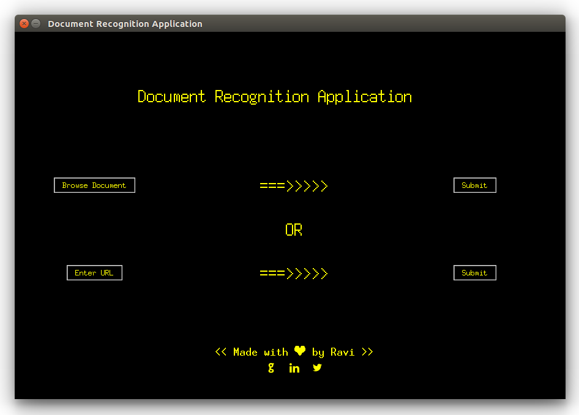

# Document Recognition
A simple python based Document Recognition Application to identify whether a document is Form 16 or not. Form 16 is a certificate issued by an employer validating the fact that TDS has been deducted and deposited with the authorities on behalf of the employee.

## Demo

This application requires either a local document or url of document if it is not present on your personal computer (document should be in image or pdf format). It will work as input for the application and it will predict that whether the document submitted is form 16 or not. Application requires a internet connection as it makes request to an online API to extract text from image or pdf. 

Document file size shold not be greater than 1 MB. In case of pdf it should not be more than 3 pages. Image should have dpi greater than 300 dpi (dots per inch).
## Built With
- [Tkinter](https://docs.python.org/2/library/tkinter.html) - Graphical User Interface
- [Pandas](https://pandas.pydata.org/) - For importing dataset
- [scikit-learn](https://scikit-learn.org) - For classification

## Acknowledgements
- Thanks to [Free OCR API](https://ocr.space/ocrapi) for parsing image and pdf and return the extracted text in json format.
- Thanks to [Flaticon](https://www.flaticon.com/home) for providing icons of social links.
- Thanks to [TRACES](https://contents.tdscpc.gov.in/) for providing form 16 and other forms. 
- Thanks to [Zaargh](https://github.com/Zaargh/ocr.space_code_example/blob/master/ocrspace_example.py) for providing code snippet to extract text from OCR.space API using `requests.post`.